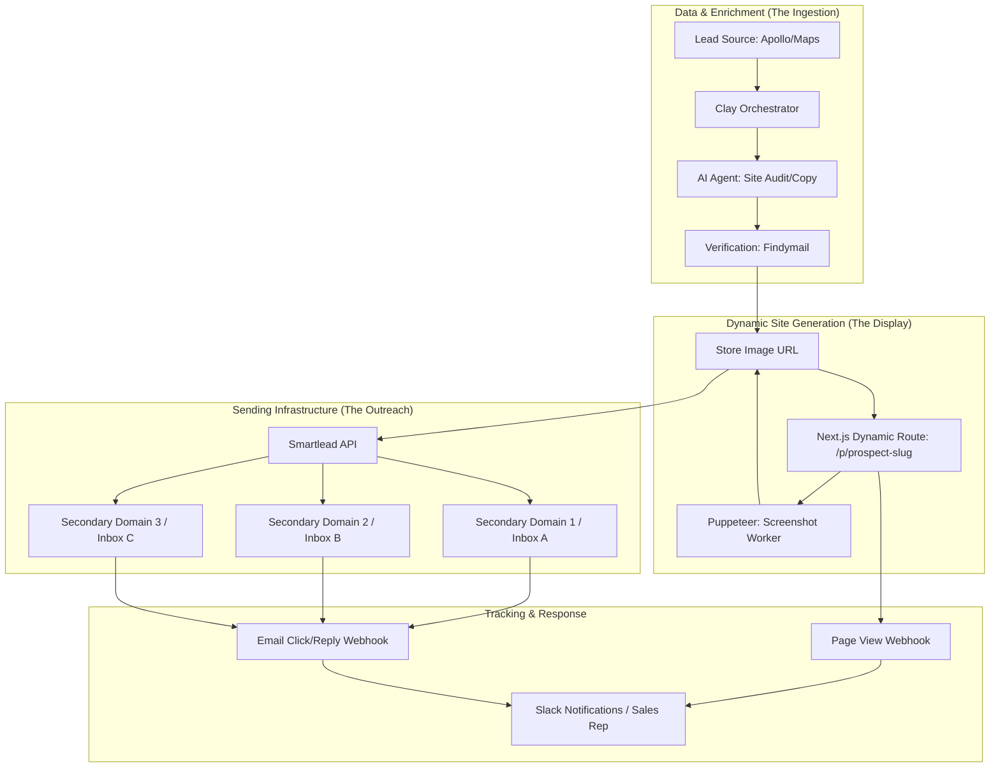

# Architecture Patterns

**Domain:** Lead Generation & Outreach Automation
**Researched:** 2024-10-25
**Overall Confidence:** HIGH

## Recommended Architecture: "The Distributed Engine"

This architecture separates the **Lead Intelligence**, **Content Generation**, and **Sending Fleet** to ensure reliability and deliverability.

### Component Boundaries

| Component | Responsibility | Communicates With |
|-----------|---------------|-------------------|
| **Clay** | Enrichment & Orchestration. Fetches logos, company info, and runs AI copy prompts. | Apollo, OpenAI, Supabase. |
| **Supabase** | Central Data Hub. Stores lead status, personalized copy, and engagement metrics. | Clay, Next.js, Smartlead. |
| **Next.js (Vercel)** | Dynamic Site Renderer. Displays the personalized "Sample Website" based on URL slug. | Supabase. |
| **Puppeteer / Shotstack** | Visual Worker. Takes a screenshot of the Next.js page for use in emails. | Vercel, Supabase S3. |
| **Smartlead / Instantly** | Deliverability Layer. Rotates 50+ inboxes and sends the actual emails. | Supabase, DNS (DKIM/SPF). |

### Data Flow

1.  **Ingest**: Raw lead data is pulled into Clay.
2.  **Enrich**: Clay finds the lead's logo and uses GPT-4o to write a custom "Sample Website" headline.
3.  **Sync**: All data is pushed to Supabase.
4.  **Screenshot**: A background worker (using Puppeteer) visits the Next.js URL for that lead and takes a screenshot.
5.  **Campaign**: Smartlead pulls the lead's email, custom URL, and screenshot URL from Supabase and adds them to a sequence.
6.  **Engagement**: When the lead clicks the link, Vercel sends a webhook to Supabase and Slack.

## Patterns to Follow

### Pattern 1: Multi-Domain Infrastructure
**What:** Distributing sending across many domains to protect the main brand.
**When:** Always.
**Example:**
-   Main: `acme.com`
-   Outreach: `getacme.com`, `acmelabs.io`, `tryacme.net`

### Pattern 2: Dynamic Content Templating
**What:** Using a single code-base (Next.js) with dynamic variables for personalization.
**Instead of:** Building 1,000 static HTML files.

## Anti-Patterns to Avoid

### Anti-Pattern 1: The "Single Inbox Sink"
**What:** Sending 500 emails/day from one inbox.
**Why bad:** High risk of "Blacklisting" the IP/Domain.
**Instead:** Send 30-50 emails/day across 10-15 inboxes.

### Anti-Pattern 2: No Verification
**What:** Sending to "guessed" emails without a checker.
**Why bad:** High bounce rate (>3%) flags you to Gmail/Outlook as a spammer.
**Instead:** Use MillionVerifier or Apollo's built-in verification before every send.

## Sources

- [Vercel OG Image Generation Guide](https://vercel.com/docs/concepts/functions/edge-functions/og-image-generation)
- [Smartlead.ai API Documentation](https://api.smartlead.ai/reference)
- [Supabase Edge Functions Documentation](https://supabase.com/docs/guides/functions)
