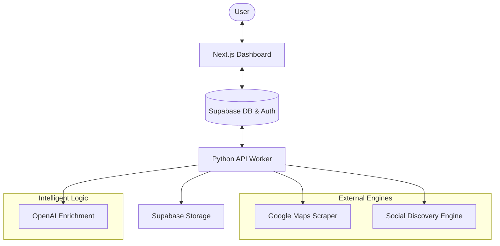

# Lead Engine SaaS 🚀

A high-performance, AI-powered Lead Generation and Discovery Engine. This platform scrapes local business data from Google Maps, deep-extracts social media and email information, and enriches it using AI—all accessible via a premium Next.js dashboard.

---

## 🏗️ Architecture Overview

The system is built with a decoupled architecture focusing on reliability, speed, and AI-driven precision.



---

## ✨ Key Features

- **📍 Intelligent Maps Scraping**: Extracts targeted local business data (names, phone numbers, categories, ratings) from Google Maps.
- **🔍 Deep Email Discovery**: Goes beyond standard scraping by analyzing social media profiles (Facebook, Instagram) to find elusive contact emails.
- **🤖 AI Enrichment**: Uses OpenAI to qualify leads, categorize businesses, and extract key insights from reviews and websites.
- **📊 Premium SaaS Dashboard**: A full Next.js application with real-time job tracking, lead management, and export capabilities.
- **💳 Integrated Billing**: Fully functional subscription management powered by Stripe.
- **📸 Visual Verification**: Automated screenshots of found websites stored directly in Supabase.
- **📁 Multi-Format Export**: Export your curated leads to high-quality Excel or CSV files.

---

## 🛠️ Tech Stack

- **Frontend**: Next.js 16 (App Router), TypeScript, Framer Motion, Lucide React, Tailwind CSS.
- **Backend/Workers**: Python 3.13, FastAPI, Playwright, Scrapling, Patchright.
- **Database**: Supabase (PostgreSQL).
- **Authentication**: Supabase Auth.
- **Payment Processing**: Stripe.
- **AI Engine**: OpenAI GPT models.
- **Deployment**: Docker & Docker Compose.

---

## 🚀 Getting Started

### 1. Prerequisites
- Python 3.11+
- Node.js 20+
- Supabase Project
- OpenAI API Key
- Stripe Account (for billing)

### 2. Backend Setup
```bash
# Install dependencies
pip install -r requirements.txt

# Setup Playwright
playwright install chromium
```

### 3. Frontend Setup
```bash
cd templates
npm install
npm run dev
```

### 4. Database Setup
Follow the [SAAS_SETUP.md](SAAS_SETUP.md) for detailed SQL migration steps to initialize your Supabase instance.

---

## ⚙️ Configuration

### Environment Variables
Configure these in `templates/.env.local` and your system environment:

| Variable | Description |
| :--- | :--- |
| `NEXT_PUBLIC_SUPABASE_URL` | Your Supabase project URL |
| `NEXT_PUBLIC_SUPABASE_ANON_KEY` | Supabase public API key |
| `SUPABASE_SERVICE_ROLE_KEY` | Admin key for backend worker auth |
| `OPENAI_API_KEY` | API key for lead enrichment |
| `STRIPE_SECRET_KEY` | Your Stripe secret key for payments |

### Scraper Settings
Customize the engine behavior in `src/config.py`:
```python
SCRAPE_SETTINGS = {
    "max_results_per_search": 20,
    "max_reviews_per_lead": 150,
    "default_timeout": 30000,
}
```

---

## 📂 Project Structure

- `src/`: Core Python scraping and enrichment logic.
- `templates/`: Next.js SaaS dashboard frontend.
- `supabase/`: SQL migrations and security policies.
- `exports/`: Default directory for generated lead reports.
- `tests/`: Comprehensive test suite for backend components.
- `skills/`: Shared AI agent knowledge and interaction patterns.

---

## 🛡️ License
This project is private and intended for internal use only.
