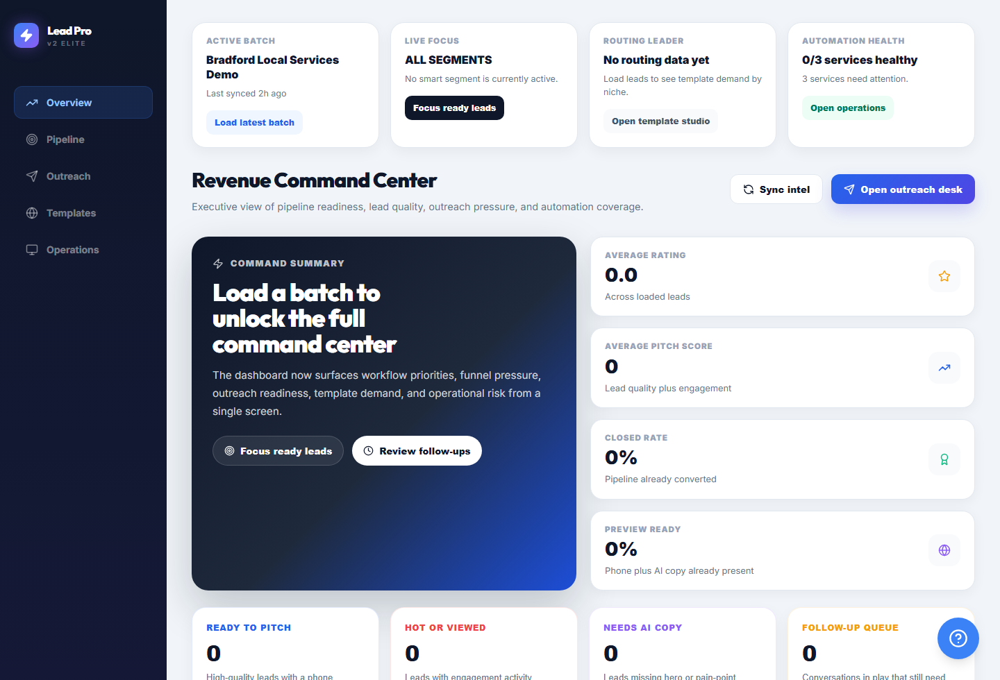
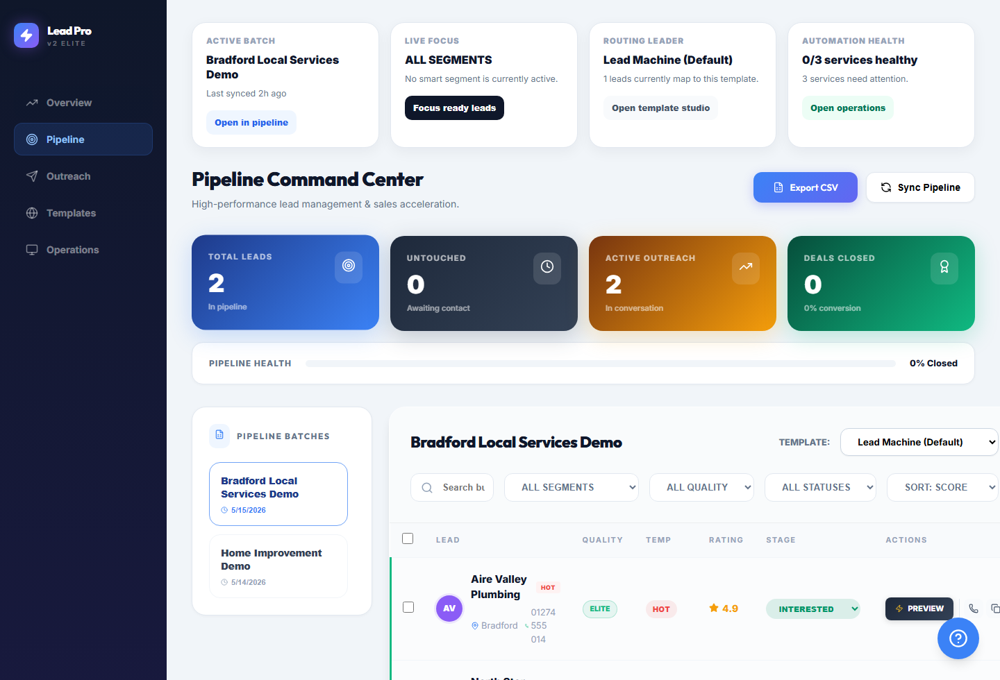
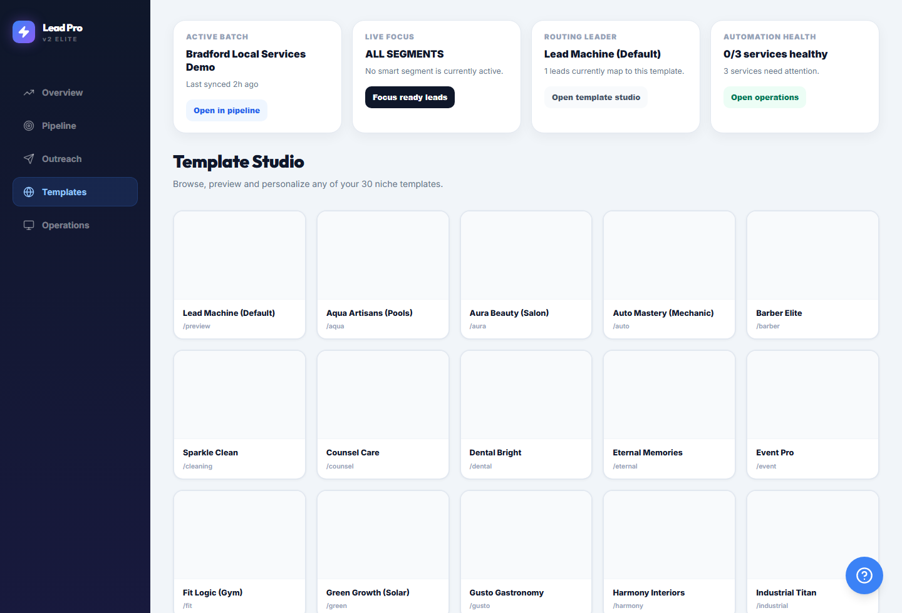
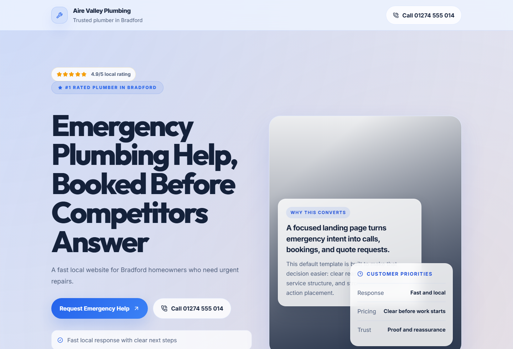
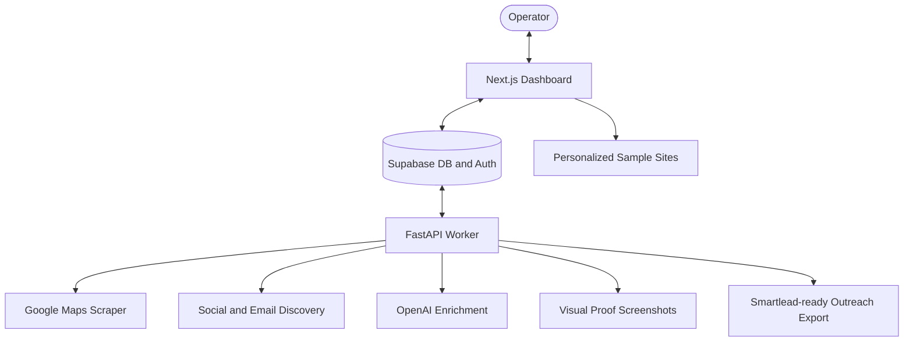

# Lead Engine SaaS

An AI-assisted lead generation and website preview system for agencies selling websites to local businesses. The platform finds businesses without strong web presence, enriches them with AI-generated positioning, generates personalized sample-site links, and gives operators a dashboard for pipeline review, outreach, and conversion tracking.

## Product Screenshots

### Revenue Command Center



### Lead Pipeline



### Template Studio



### Personalized Sample Site



## Architecture


```mermaid
graph TD
    User([Operator]) <--> Dashboard[Next.js Dashboard]
    Dashboard <--> SupabaseDB[(Supabase DB and Auth)]
    Dashboard --> PublicSites[Personalized Sample Sites]
    SupabaseDB <--> APIWorker[FastAPI Worker]
    APIWorker --> MapsScraper[Google Maps Scraper]
    APIWorker --> SocialDiscovery[Social and Email Discovery]
    APIWorker --> AIEnrich[OpenAI Enrichment]
    APIWorker --> Screenshots[Visual Proof Screenshots]
    APIWorker --> Outreach[Smartlead-ready Outreach Export]
```

## Key Features

- Google Maps lead discovery for local businesses without websites.
- Detail extraction for names, phone numbers, categories, ratings, addresses, reviews, and social links.
- Email discovery from public social profiles where available.
- OpenAI-powered copy generation for niche-specific sample websites.
- Screenshot worker for visual proof assets.
- Next.js command center for pipeline review, lead scoring, filtering, CRM notes, and outreach exports.
- Public personalized sample-site templates across many niches.
- Supabase-ready auth, multi-tenant data model, RLS policies, billing columns, audit logs, and worker job tracking.
- Stripe checkout, webhook handling, and billing portal route.
- Local demo mode for reviewing the dashboard without production credentials.

## Tech Stack

- Frontend: Next.js 16 App Router, React 19, TypeScript, Framer Motion, Lucide React.
- Backend: Python, FastAPI, Playwright, Scrapling, Patchright.
- Database: Supabase Postgres with RLS.
- Auth: Supabase Auth.
- Payments: Stripe.
- AI: OpenAI.
- Exports: Excel and CSV.
- Deployment: Docker and GitHub Actions.

## Local Preview

```bash
cd templates
npm install
npm run build
npm run start -- --hostname 127.0.0.1 --port 3001
```

Open:

```text
http://127.0.0.1:3001/login
```

For local review without Supabase credentials, click `CONTINUE IN LOCAL DEMO`.

Public sample site preview:

```text
http://127.0.0.1:3001/preview?name=Demo%20Services&niche=Plumber&location=London
```

## Backend Setup

```bash
pip install -r requirements.txt
playwright install chromium
python -m pytest tests
```

Run the worker:

```bash
uvicorn src.api_worker:app --host 0.0.0.0 --port 8000
```

Run a local scrape:

```bash
python -m src.main --niche "plumber" --location "Bradford" --max-results 20
```

## Configuration

Configure these in `templates/.env.local` and the backend runtime:

| Variable | Purpose |
| --- | --- |
| `NEXT_PUBLIC_SUPABASE_URL` | Supabase project URL |
| `NEXT_PUBLIC_SUPABASE_ANON_KEY` | Supabase public anon key |
| `SUPABASE_SERVICE_ROLE_KEY` | Backend worker and sync access |
| `OPENAI_API_KEY` | AI enrichment |
| `STRIPE_SECRET_KEY` | Stripe checkout, webhook, and billing portal |
| `STRIPE_PRICE_ID` | Subscription price |
| `STRIPE_WEBHOOK_SECRET` | Stripe webhook verification |
| `WORKER_ALLOWED_ORIGINS` | Allowed frontend origins for the FastAPI worker |
| `CUSTOMER_SUCCESS_WEBHOOK_URL` | Optional customer-success event webhook |
| `NEXT_PUBLIC_SUPPORT_EMAIL` | Support link shown in the dashboard |

Database setup is documented in [SAAS_SETUP.md](SAAS_SETUP.md).

## Project Structure

```text
src/                         Python scraping, enrichment, worker, sync logic
templates/                   Next.js dashboard and public sample-site templates
supabase/migrations/          Database schema, RLS, billing, audit, job tracking
tests/                       Backend and browser smoke tests
docs/readme-assets/          README screenshots captured from the local app
exports/                     Local generated lead exports and screenshots
```

## Verification

Current local verification:

```bash
ruff check .
npm run lint --prefix templates
npm run build --prefix templates
python -m pytest tests
```

Recent result: `14 passed` with the local production server running for browser smoke tests.

## License

Private internal project.
